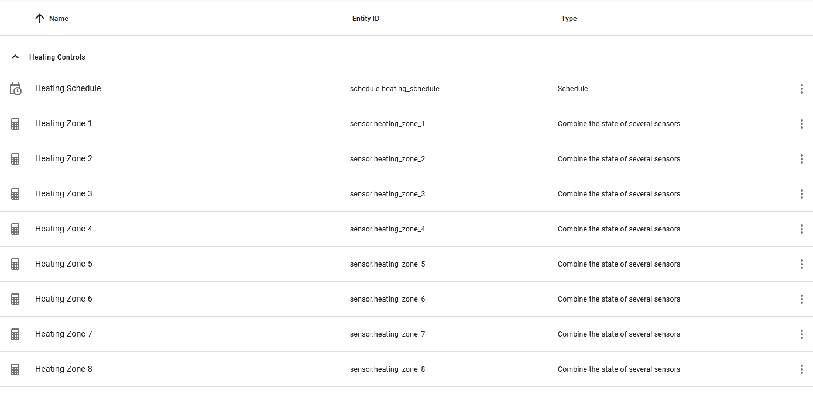

# Retrofit Multizone Underfloor Heating Controller

I've built a custom controller for my 8-zone underfloor heating system:

### Problem / Rationale

The underfloor heating system supplied with has 8 zones, each one has been fitted with a 'dumb' thermostat. Specifically the [Emetti CS17 Timeswitch](https://emmeti.co.uk/products/zone-controls/cs17-touchscreen-programmable-thermostat/):

but I'm sure you know the sort. One that has an internal schedule that is used to control when the heating is on, but is a real pain to program. Worse, there are 8 separate controllers that each need to be programmed separately!

The solution: Move all this to [Home Assistant](https://www.home-assistant.io/)!

### Bill of Materials

* 1x [ESP32 relay board x8](https://devices.esphome.io/devices/ESP32E-Relay-X8)
* 8x [Mi Temperature and Humidity Monitor 2](https://buy.mi.com/uk/item/3204500023)
* 1x [Hi-Link HLK-PM01 5v 600ma power supply](https://lygte-info.dk/review/Power%20Mains%20to%205V%200.6A%20Hi-Link%20HLK-PM01%20UK.html) 
* 1x Multiway terminal block (to distribute power to the relay common terminals)
* 1x 8-way terminal block (to connect on to the heating channels)
* 1x DPDT switch, to disconnect the ESP powersupply if necessary.
* 1x Fuse and holder (just in case!)
* Box, standoffs, some terminals, hot glue - to house everything.

### Construction

Power the ESP device via the 5v terminal. Connect Live to all the Common inputs, connect the NO outupt to each indivdual heating actuator.

I'm hoping the picture explains everything, but feel free to reach out with questions!

### Firmware

I'm using the ESPHome climate component with the relays as the actuators, and home-assistant as the input. However I've made some tweaks. Here are the highlights:
 * The firmware remembers the setpoint whenever it is changed.
 * Added a "master control" virtual switch, to easily disable the whole system.
 * Added a firmware-based boost preset that heats for a limited period.
 * Added an 'eco-mode' that sets the temperature a couple of degreees below the usual setpoint.
 * Some logic to ensure that if the home assistant connection is down the heating is off.
 * Some clever tricks to avoid repeating everything 8 times!

See the [main project](../heating.yaml). Lots of comments in there.

### Installation

I have an [Emmeti EWC-2 Wiring Centre](https://emmeti.co.uk/products/zone-controls/wiring-centres/). Although this was already installed it has some spare terminals intended for powering an external timeswitch which are perfect for powering this project (highlighted in the diagram here):

I could have wired the outputs into blocks H above, but I wanted to leave the existing timeswitches in place just-in-case. Fortunately the wires to the actuators were already spliced further down it was easy to wire the extra inputs in parallel. Note that with the EWC-2 wiring centre it doesn't matter if you power the actuater via the `SwL` switch-live input terminal, or via the `L1` live output terminal, either way the EWC will know to start the pump. 

### Control via Home Assitant

This is still work-in-progress, but it mostly "just works". I setup some helpers for the temperature inputs, so that I can decide in HASS which thermometers control which zones:

I use the standard climate control widget to set the temperature:

For scheduling I use the suprpisingly excellent [scheduler-component](https://github.com/nielsfaber/scheduler-component) / [scheduler-card](https://github.com/nielsfaber/scheduler-card) addon:

With this I can have different schedules (work day, weekend, work-from-home, etc). My plan is to setup an automation that figures out what kind of day it is and enables that schedule accordingly.

